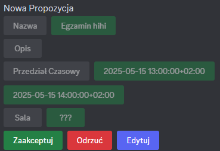

# Event Discord Bot

## Purpose
This Bot's purpose is to help manage discord events.

## How does it work?
User can type a `stworz` command. It creates a message with buttons, which represent event informations, like name, description, start and end time and place. Such a message can later be:
* accepted, what creates event
* denied, what removes message
* edited, what changes proposed event information

